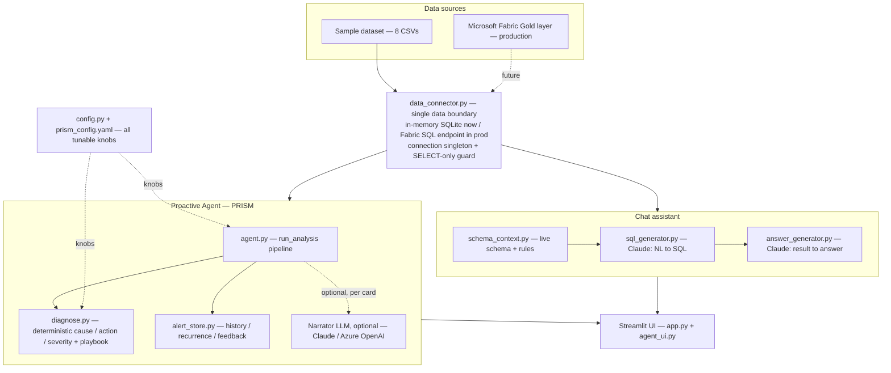
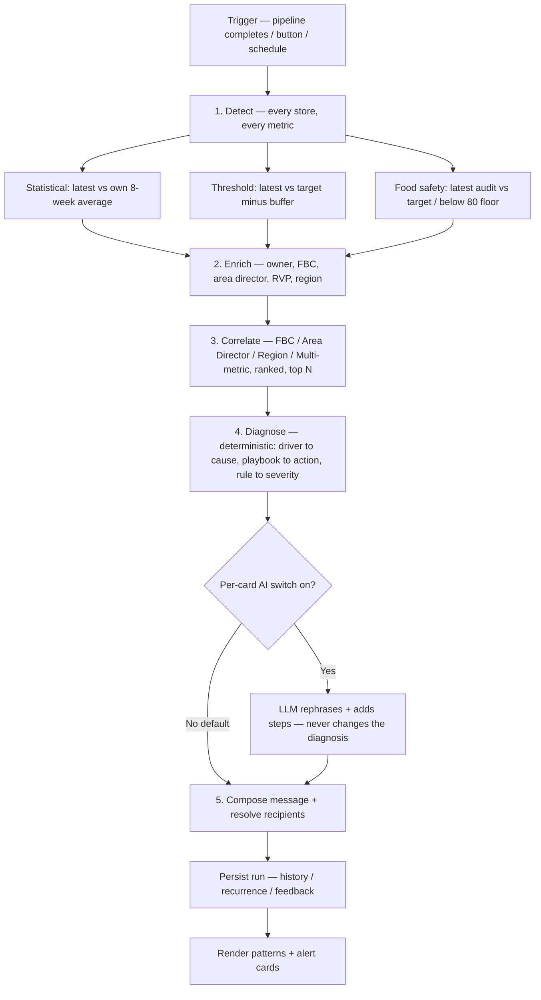

# PRISM — Technical & Functional Documentation

**PRISM — Proactive Recommendation & Insight System for Metrics**
Jersey Mike's Data Platform · World Wide Technology (WWT)

_This document explains what PRISM is, the problem it solves, its functionality, architecture, process flow, the technical design, and the work done to bring it to its current state. It is intended as a combined functional + technical reference and handoff._

---

## 1. At a glance

- PRISM watches every store's key metrics and, the moment fresh data lands, **flags what's wrong, explains why, recommends an action, and routes it to the responsible person** — before anyone opens a report.
- It is the proactive half of a Streamlit app, **"Jersey Mike's Data Assistant."** The other half is a natural-language chat assistant (ask questions → SQL → answer).
- **Core principle:** the deterministic core decides everything factual — *what* is wrong, the numbers, the severity, the cause, and the recommendation. An LLM is **optional** and only ever rephrases already-decided facts.
- Watches four metrics: **Same-Store Sales, Customer Satisfaction (OSAT), EBITDA margin, Food Safety.**
- The differentiator vs a dashboard: it **correlates** anomalies across the org hierarchy — e.g. "five stores under one field consultant, all slipping together" — into a single systemic insight.
- Runs on a realistic sample dataset today; designed to switch to the live **Microsoft Fabric** Gold layer by changing one module.

---

## 2. What PRISM is

A traditional BI stack *reports* numbers and waits for a human to notice a problem. PRISM is the layer that **reads the numbers automatically** and turns them into routed, explained, actionable alerts.

Mechanically it is a single Python entry point, `run_analysis()`, that executes a five-stage pipeline (**detect → enrich → correlate → diagnose → route**). Detection and correlation are fully deterministic (plain Python + SQL). Diagnosis (cause, recommended action, severity) is also deterministic, from the data plus a curated playbook. An LLM is only used, optionally and per alert, to make the wording nicer.

---

## 3. The problem it solves

| Without PRISM | With PRISM |
|---|---|
| Someone must open a dashboard and scan it to notice a problem. | The moment data lands, problems are detected automatically. |
| Each metric is a separate chart per store — a human mentally assembles patterns. | Anomalies are **correlated** across stores, metrics, and the org hierarchy into systemic patterns. |
| "Sales are down" — but is it traffic or ticket? A person must dig. | The **cause** is decomposed from the data (e.g. traffic-led vs ticket-led). |
| No standard "what to do next." | Each alert carries a **recommended action** from a curated playbook. |
| Nobody is explicitly told. | Each alert **resolves the responsible owner / FBC / area director / regional VP.** |

The net effect: issues surface earlier, with a likely cause and a recommended fix, aimed at the person who can act — with no human in the loop at detection time.

---

## 4. Functionality

The app has two tabs.

**4.1 Ask a Question (chat assistant).** A user asks about franchise performance in plain English. `sql_generator.py` uses Claude + a live schema description (`schema_context.py`) to write a SQLite query; `data_connector.execute_query` runs it (read-only); `answer_generator.py` uses Claude to turn the result into a short business-language answer. Generated SQL and raw data are shown in expanders.

**4.2 Proactive Agent (PRISM).** On trigger it:
- Scans every store on all configured metrics and flags anomalies two independent ways.
- Attaches each anomaly's location and full chain of responsible people.
- Correlates anomalies into systemic patterns (FBC / Area Director / Region / Multi-metric store).
- Attaches a deterministic cause, recommended action and severity to each alert and pattern.
- Composes the alert message that *would* be sent (it displays it; it does not transmit).
- Persists every run so history, recurrence ("times seen"), open/resolved status and 👍/👎 usefulness feedback survive across sessions.
- Offers a **per-card Data/AI switch**: "Data" shows the deterministic wording (default, no API call); "AI" asks the model to rephrase and enrich that card's wording only.

---

## 5. Architecture

**Layers, top to bottom:**

- **Data boundary (`data_connector.py`).** Everything that reads data goes through `get_connection()` + `execute_query(conn, sql)`, which return a `(DataFrame, error)` tuple. Today it loads 8 CSVs into one in-memory SQLite database (built once and reused). In production this single module is repointed at the live Microsoft Fabric model; nothing downstream changes. A read-only guard rejects anything that isn't a single `SELECT`.
- **Chat path.** `schema_context.py` → `sql_generator.py` → `answer_generator.py`.
- **Agent path.** `agent.py` runs the pipeline; `diagnose.py` produces cause/action/severity deterministically; `alert_store.py` persists results; an optional narrator LLM only rephrases.
- **Configuration (`config.py` + `prism_config.yaml`).** All tunable knobs live here; the agent and diagnosis import them.
- **UI (`app.py`, `agent_ui.py`).** The two-tab Streamlit interface.

---

## 6. Process flow (the pipeline)

`run_analysis(max_alerts, reason=True, narrate=False)` is **trigger-agnostic** — a button today, a Gold-layer pipeline step or scheduler tomorrow, with no code change.

Key property: **patterns are computed on the full anomaly set before the display trim**, so a systemic pattern is never hidden just because its individual stores didn't make the top-N card list.

---

## 7. Detection (technical)

For every store, each weekly metric is tested two independent ways; an anomaly is recorded if **either** fires, and the methods that fired are stored so the UI can label it.

- **Method 1 — Statistical (vs the store's own history).** The latest week is compared to the store's own trailing average over the previous N weeks (8 by default). If the percentage drop exceeds the metric's `pct_drop_threshold`, it flags. Catches a sudden decline even if still near target.
- **Method 2 — Threshold (vs target).** The latest value is compared to the target from `Ref_Targets` (the `Franchisee` tier), but only flags when the breach exceeds a per-metric `min_target_gap` — preventing a flood of stores a hair below target. Catches chronic underperformance a trend check misses.

Both fire independently; the higher severity wins.

**Food safety is modeled differently on purpose.** FSA scores are discrete audit events, not weekly rows, so a trailing average is meaningless. PRISM keeps each store's most recent audit and flags it if it is below target **or** below a hard `critical_floor` of 80 (any audit under 80 is automatically Critical). This models how food safety actually works — event-driven with an absolute danger line.

**Current thresholds** (all in `prism_config.yaml`):

| Metric | Statistical drop | Below-target buffer | Target (Franchisee) |
|---|---|---|---|
| Same-Store Sales (`SSS_Pct`) | 25% | 3.0 pts | 5.0 |
| Customer Satisfaction (`OSAT_Pct`) | 8% | 5.0 pts | 85 |
| EBITDA Margin (`EBITDA_Pct`) | 20% | 4.0 pts | 20.8 |
| Food Safety (`FSA_Score`) | — (event-based) | vs target 93 | 93 (+ hard floor 80) |

**Engineering note — no SQL window functions.** The bundled SQLite predates 3.25, so `ROW_NUMBER() OVER` / `AVG() OVER` are unavailable. PRISM pulls raw rows with portable SQL and computes the latest-week + trailing average in pandas. Side benefit: the SQL stays engine-portable for the Fabric move. `FiscalWeekKey` is a `DD-MM-YYYY` string, so it is parsed to a real date before sorting (a text sort would pick the wrong "latest week").

---

## 8. Correlation (the differentiator)

After enrichment, `_find_patterns()` groups the full anomaly set four ways. Each pattern is scored so the most significant sort to the top, and the list is capped.

| Pattern | Groups by | Fires when | Meaning |
|---|---|---|---|
| FBC | Field consultant | ≥ 2 stores | One consultant's stores are slipping together |
| Area Director | Area director | ≥ 3 stores | A whole territory shows a cluster |
| Region | Region + metric | ≥ 3 stores | A geographic problem on one metric |
| Multi-Metric Store | Single store | ≥ 2 metrics | One store failing on several fronts at once |

Scoring weights (per store / per metric) and the cap are all config knobs. A dashboard shows each of these as a separate dot on a separate chart; PRISM connects them into one systemic insight with one root cause.

---

## 9. Cause, recommendation & severity — Data vs AI (hybrid)

This is where the "why" and "what to do" come from. There are two layers.

**By data (default, `diagnose.py`, no API call):**
- **Cause** is computed by decomposing sub-metrics the warehouse already holds:
  - *SSS* — compares the store's latest weekly transactions and average ticket to their trailing averages: fewer customers but steady spend → **traffic-led**; steady customers but lower spend → **ticket-led**; both → **both soft**; neither but still below target → **comp / trade-area**.
  - *OSAT* — reads the four guest sub-scores (Food Quality, Service, Cleanliness, Value); the **lowest** is named the driver.
  - *FSA* — uses the audit's actual priority finding; if none, reports the score is below the 80 floor.
  - *EBITDA* — sales also declining → **sales-driven**; otherwise → **cost / labor-driven**.
- **Recommendation** = a lookup in a curated **PLAYBOOK** (a "if the problem is X, do Y" reference sheet) keyed on the diagnosed driver. Fixed and identical every run — auditable.
- **Severity** = a deterministic rule (food-safety floor breach or a ≥40% drop → Critical; both methods / ≥25% drop / ≥6-pt gap → High; else Moderate).

**By AI (optional, per-card switch):** the model receives the already-decided cause/action plus the fixed facts (store, metric, severity, the driver's numbers, and the store's other flagged metrics). It may only (a) restate the cause in plain language for the responsible role, (b) connect the store's co-occurring issues into one story, and (c) expand the action into 2–3 concrete first steps. It **cannot** change the diagnosis or invent numbers, and on any failure it falls back to the deterministic text.

This is the backbone of the design: **the model can never invent an anomaly, a cause, a recommendation or a severity.** By default the agent runs end-to-end with zero API calls.

---

## 10. Data model

Eight tables are loaded (from CSVs today, from Fabric Gold later):

| Table | Role |
|---|---|
| `Fact_StoreWeekly` | Weekly per-store metrics (SSS, OSAT, EBITDA, transactions, ticket, FBC, RVP…) |
| `Fact_FSAScore` | Food-safety audit events (score, findings, date) |
| `Fact_OSAT` | Guest-survey sub-scores (Food Quality, Service, Cleanliness, Value) |
| `Dim_Store` | Store master (city, region, franchise owner, area director) |
| `Dim_FranchiseOwner` | Owner master (store count, FBC) |
| `Dim_Region` | Region master |
| `Dim_Date` | Date dimension |
| `Ref_Targets` | Targets by persona tier (Corporate / Regional / FBC / Franchisee) |

**Join note:** `Fact_StoreWeekly.StoreID` is a plain integer while the other tables prefix it with `#`; joins reconcile with a `REPLACE(...)` on both sides. In production the Gold layer should standardize keys.

The data folder is set by `DATA_DIR` in `data_connector.py` (`data` for the sample set, `prism_test_data` for the labeled test set).

---

## 11. Configuration — tune without code changes

All tunable knobs live in **`prism_config.yaml`**, loaded by `config.py`. If the file is missing or malformed, `config.py` falls back to built-in defaults and prints a warning, so the app always runs. Covered knobs:

- Target persona; `max_alerts`; narrator and chat model ids.
- The **watched-metric list** (add a metric = add a block — no code change), with each metric's direction, trailing window, target column, statistical threshold and target buffer.
- Food-safety label, target column and critical floor.
- Correlation fire-thresholds, score weights and the pattern cap.
- Deterministic severity bands.
- Diagnosis tuning (traffic/ticket cutoff).
- The full recommendation **PLAYBOOK** (to be curated with operations).

---

## 12. Technology stack

| Component | Choice | Why |
|---|---|---|
| Language | Python 3.10+ | — |
| UI | Streamlit | Pure-Python UI, fast to build |
| Data (now) | in-memory SQLite + pandas | Zero-setup stand-in for the Fabric endpoint |
| Analytics core | pandas + standard library | Portable; does the ranking/aggregation SQLite couldn't |
| LLM (optional) | `anthropic` (Claude); Azure OpenAI in production | Clean SDK; Azure keeps data in-tenant |
| Config | `pyyaml` | Ops-editable knobs |
| Secrets | `python-dotenv` (`.env`) | Keeps the API key out of code |

---

## 13. Persistence, history & feedback

`alert_store.py` writes every run to a local SQLite file (`prism_history.db`):
- **History** of what was flagged, per run.
- **Recurrence** — a "times seen" count for the same store + metric.
- **Open / resolved status**, with a resolve control in the UI.
- **👍/👎 usefulness feedback** per card, plus an all-time "% marked useful" value metric.

This is what gives the tool a reason to be checked repeatedly rather than once, and it is the raw material for tuning thresholds later.

---

## 14. Security & safety

- **Read-only SQL guard** — `execute_query` refuses anything that isn't a single `SELECT`/`WITH` (blocks `DROP`/`DELETE`/stacked statements). Matters most once pointed at live Fabric.
- **HTML escaping** — every data- or AI-derived value rendered in the UI cards is escaped, so a store name, audit finding or model output containing markup can't inject.
- **Fails safe** — the optional LLM calls degrade to the deterministic text on any error; the agent otherwise makes no external calls.
- **Honest by construction** — PRISM composes but does **not** transmit alerts; the UI says "routed / ready to send," never "sent."
- **In-tenant plan** — in production the narrator would call Azure OpenAI, keeping client data inside the Microsoft cloud alongside Fabric.
- **Secrets** — API key via `.env`; `.gitignore` excludes `.env`, `venv/`, `__pycache__/`, and the history DB.

---

## 15. Testing & verification

A labeled test dataset (`prism_test_data/`, 10 stores × 10 weeks) plants a known anomaly in each store — sudden drops, below-target, a multi-metric store, a food-safety floor breach, a below-target audit, a statistical-only OSAT dip — plus healthy control stores. Running PRISM against it confirmed: **all 8 planted anomalies detected, all 6 expected patterns found, and the 3 control stores stayed clean** (no false positives). It also demonstrated the display cap behaving as designed (a trimmed card still surfaced via its pattern). A formal `pytest` suite built on this dataset is the recommended next step.

---

## 16. Work done in this engagement

**Correctness fixes**
- Fixed the target-persona bug (`"FranchiseOwner"` → `"Franchisee"`) that had silently disabled all "below target" detection — OSAT and EBITDA had been producing **zero** alerts.
- Added a **connection singleton** (the DB was being rebuilt ~56× per run).
- Replaced the hardcoded pipeline banner date with the **real latest week** from the data.

**Detection & UX**
- Each alert now shows the **size of the miss** (e.g. "−27%", "−4.0 pts").
- Food-safety floor breaches get their own **"Below safety floor"** label (previously mislabeled "Sudden change").

**Hybrid reasoning (the major change)**
- New `diagnose.py` makes **cause, recommendation and severity fully deterministic**; the LLM no longer decides anything. This also removed a bug where the model's severity label non-deterministically reordered alerts.

**AI as an optional narrator**
- A **per-card Data/AI switch** on both alert and pattern cards. The AI mode adds an audience-tailored explanation, a cross-metric story, and concrete steps — without touching the diagnosis; lazy and cached per card.

**Persistence, config & safety**
- New `alert_store.py` — history, recurrence, status, feedback.
- New `config.py` + `prism_config.yaml` — all tunable knobs, with safe fallback to defaults.
- Safety pass — read-only SQL guard, HTML escaping, centralized model ids, `.gitignore`, and this documentation set (`README.md`, critical review, state/changes, overview).

**New files added:** `diagnose.py`, `config.py`, `prism_config.yaml`, `alert_store.py`, `README.md`, `.gitignore`, `prism_test_data/`.

---

## 17. Current limitations & roadmap

**Known limitations**
- Cause identifies the *proximate driver* (what's low), not the ultimate root cause (why — staffing, competition, weather); some root causes aren't in the data.
- Enrichment currently picks the FBC/RVP via a text sort of `FiscalWeekKey` (should parse to a date, like detection does).
- No automated test suite / CI yet.
- The `PLAYBOOK` wording is a starting point and needs sign-off from Jersey Mike's operations.

**Roadmap (rough order)**
1. Automated `pytest` suite (built on the labeled dataset) + CI.
2. Make `DATA_DIR` env-driven; add startup schema validation that fails loudly on missing/renamed tables.
3. **Fabric + Azure OpenAI cutover** behind the existing `data_connector` boundary.
4. Real pipeline trigger (replace the Simulate button) + real email/Teams dispatch.
5. Use the collected 👍/👎 feedback to tune thresholds; optional auto-suggest of new metrics from the Gold schema.

---

## 18. Appendix — file map

| File | Purpose |
|---|---|
| `app.py` | Streamlit entry point (two tabs) |
| `agent.py` | PRISM pipeline: `run_analysis()` — detect → enrich → correlate → diagnose → compose |
| `diagnose.py` | Deterministic cause / action / severity + PLAYBOOK lookup |
| `config.py` / `prism_config.yaml` | All tunable knobs (with safe fallback) |
| `data_connector.py` | Data-access boundary (SQLite now; Fabric swap point) + read-only guard |
| `alert_store.py` | Alert history / recurrence / feedback (`prism_history.db`) |
| `schema_context.py` | Live schema + business rules for the chat assistant |
| `sql_generator.py` | Chat: natural language → SQL (Claude) |
| `answer_generator.py` | Chat: result → business-language answer (Claude) |
| `agent_ui.py` | Proactive Agent UI (cards, patterns, switches, history) |
| `prism_test_data/` | Labeled test dataset + its README |
